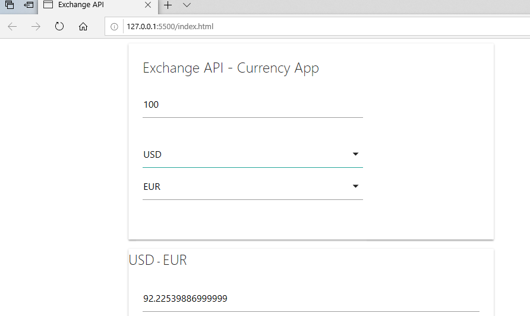

# CurrencyConversion
 Currency Calculator JavaScript Project
 
This project gets current foreign exchange rates published by the European Central Bank via exchangeratesapi.io.
User selects the currencies for conversion and enters the amount. The result is calculated and showed dynamically on the page.
There are 31 available currencies.

